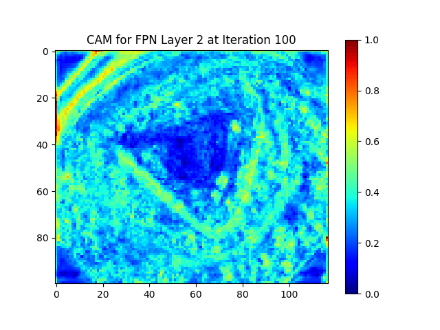
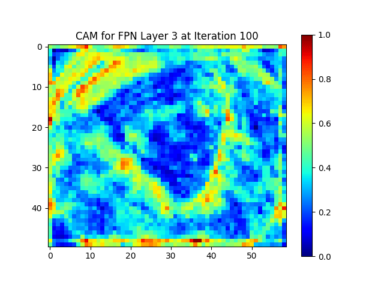

# NSPNet
Our code is coming soon

  
  

Video footage display

  
  
  
  

The class activation maps of the 100th image at different iterations during training.

More impressive results are being updated, please stay tuned.
