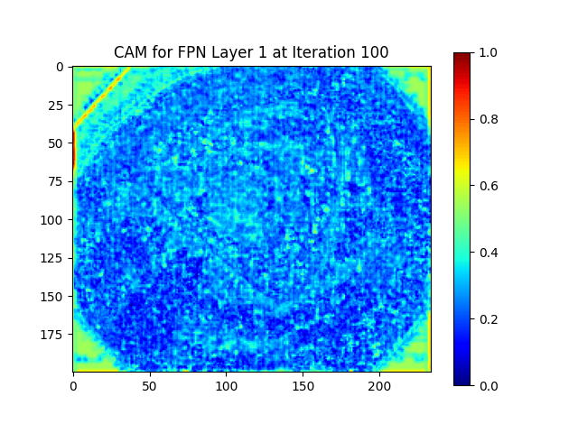
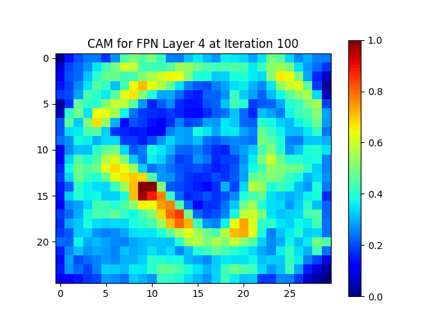

# NSPNet
Our code is coming soon

---

### Video Footage Display

  
  

  Green represents the ground truth, and yellow represents the predicted box.

---

### Detailed Comparison 
(Click on the image to download and view the HD image)

  

---

### Class Activation Maps

  
  
  
  

  The class activation maps of the 100th image at different iterations during training.

---

  More impressive results are being updated, please stay tuned.

